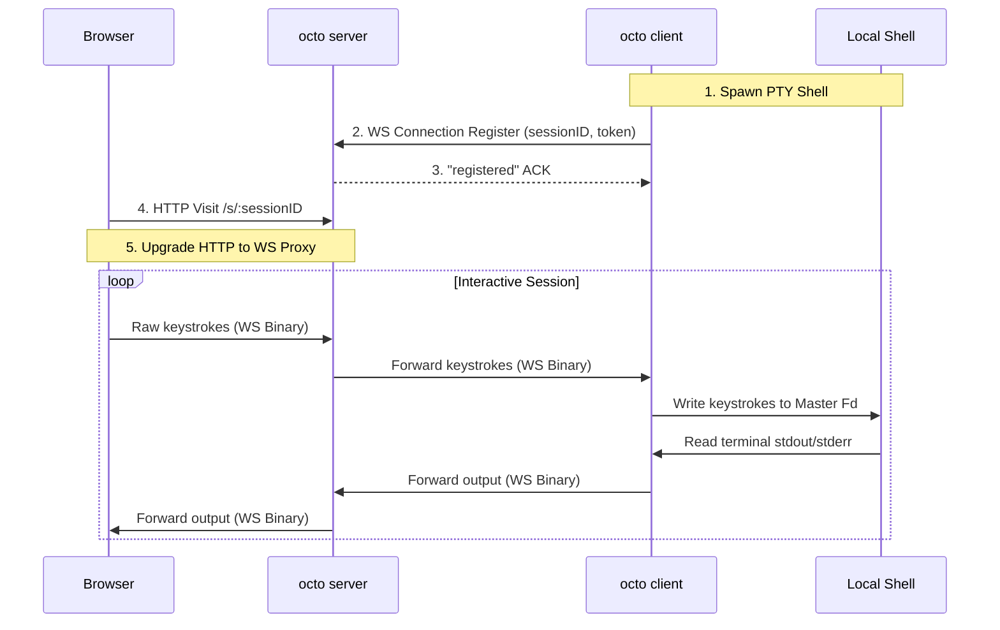

# octo 🐙

Share your interactive terminal instantly over the web with sub-150ms latency. No firewalls, no port forwarding, pure performance.

`octo` is a self-hosted alternative to `ttyd` / `ngrok` built in Go. It establishes secure, multiplexed outbound tunnels to a cloud relay server, letting you stream terminal sessions straight to any browser client without exposing your local machine.

## Key Features

- 🛡️ **Zero Firewall Config**: Uses outbound tunnels to bypass NAT traversals and port forwarding.
- ⚡ **Ultra-Low Latency**: Lightweight compiled Go byte-forwarding relay.
- 🌐 **No Client Software**: Observers only need a standard web browser.
- 🖥️ **Native PTY Isolation**: Renders ANSI color codes, curses interfaces, and standard keystrokes natively in xterm.js.

---

## Installation

Ensure you have **Go 1.20+** installed, then run:

```bash
go install github.com/abhishek-sonje/octo@latest
```

---

## Usage

`octo` operates in two modes: a **local agent (CLI)** and a **cloud relay (server)**.

### 1. Local Agent (CLI Mode)

To start sharing your default terminal shell locally:
```bash
octo --port 7681
```

By default, it will connect to the cloud relay at `wss://octo.sh` and print:
- A local URL (e.g., `http://localhost:7681?token=...`)
- A remote tunnel URL (e.g., `https://octo.sh/s/abcde`)

If you want to run it purely locally without any remote tunneling:
```bash
octo --no-tunnel --port 7681
```

To exit automatically after the first remote browser session disconnects:
```bash
octo --once
```

### 2. Cloud Relay (Server Mode)

To deploy your own self-hosted cloud relay:
```bash
octo server --port 8080
```

To point your local CLI agent to your self-hosted server, set the `OCTO_SERVER` environment variable:
```bash
export OCTO_SERVER="ws://your-relay-ip:8080"
octo --port 7681
```

---

## Technical Architecture



---

## License

MIT License. See [LICENSE](LICENSE) for details.
